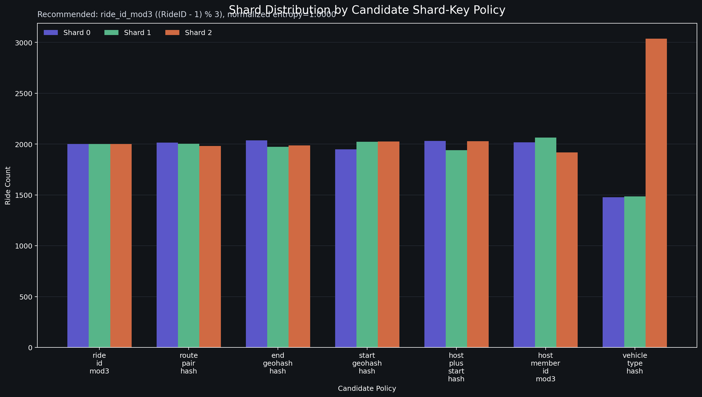

# Assignment 4 Report: Sharding of the Developed Application

## Submission Metadata

- GitHub Repository Link: https://github.com/jsmaskeen/CS432-Assignments
- Video Demonstration Link: To be added before final submission
- Course: CS 432 Databases
- Assignment: Track 1 Assignment 4

---

## 1. Objective

We extend the existing ride-sharing backend with horizontal scaling through sharding. The idea is to split ride-centric data across three shards and route requests correctly while preserving, consistency of business logic, and acceptable query latency.

We explain the below in this report

1. Shard key selection and justification.
2. Data partitioning and migration into at least three shards.
3. Query routing for lookups, inserts, and range-style access patterns.
4. Scalability and trade-off analysis (consistency, availability, partition tolerance).

---

## 2. Environment

### 2.1 Shard Simulation Approach Used

The system uses multiple databases on the same server (simulated independent shard nodes), configured as:

- shard 0: port 3307
- shard 1: port 3308
- shard 2: port 3309

Shard engines and session factories are defined in `backend/db/sharding.py`.

### 2.2 Pipeline 

The full pipeline was executed in order:

1. Cleanup/reset from SQL dump.
2. Large fake data generation.
3. Dry-run migration verification.
4. Actual migration to shards.
5. Post-migration validation.
6. Benchmarking shard lookup strategies (baseline and range-enabled).
7. Entropy-based shard-key analysis.
8. Distribution figure generation.

### 2.3 Dataset Size Used for Final Evaluation

- `rides_total`: 6000
- `bookings_total`: 13370
- `shard_count`: 3

---

## 3. SubTask 1: Shard Key Selection and Justification

### 3.1 Selection Criteria

The selected shard key should satisfy:

1. High cardinality
2. Query alignment
3. Stability after insertion

### 3.2 Partitioning Strategy Families

Before selecting a shard key formula, we evaluated all three strategy families required by the assignment.

#### A) Range-Based Partitioning

Definition: Key ranges are assigned to shard IDs (for example, 1-2000 to shard 0, 2001-4000 to shard 1, and 4001+ to shard 2).

What we implemented:

- Range-rule support via Ride_Shard_Range_Directory (a metadata table that stores `MinRideID`, `MaxRideID`, and target `ShardID`) and the configuration script.
- Runtime evaluation support through `directory_range` lookup mode (router checks range rules first to pick shard) and strategy benchmarking.

Advantages:

- Easy to reason about and debug.
- Useful for planned archival tiers and batch movement by key intervals.

Limitations:

- Can drift into skew as real insert/update patterns change.
- Requires operational maintenance of ranges and rebalancing rules.

#### B) Hash-Based Partitioning

Definition:

- Compute shard by a deterministic function of a key, then modulo by shard count.

What we implemented:

- Deterministic modulo on RideID: `shard_id = (RideID - 1) % 3` (same input RideID always maps to the same shard without any directory lookup).
- Additional hashed candidates for analysis (geohash, vehicle type, status, composite keys) where `md5(value) % 3` is used to test balance quality.

Advantages:

- Very low lookup overhead.
- Good statistical balance when key domain is suitable.
- No metadata lookup required during request routing.

Limitations:

- Harder to force special placement for specific keys without additional directory layer.

#### C) Directory-Based Partitioning

Definition:

- A lookup directory maps keys (or ranges) to shards explicitly.

What we implemented:

- Exact directory: Ride_Shard_Directory (one row per `RideID`, explicit mapping `RideID -> ShardID`).
- Range directory: Ride_Shard_Range_Directory (one row per key interval, mapping `RideID range -> ShardID`).

Advantages:

- Flexible placement and migration control.
- Useful for overrides, controlled movement, and operational tooling.

Limitations:

- Extra metadata dependency for routing.
- Slightly higher lookup overhead versus pure deterministic modulo.

#### Strategy-Level Outcome

All three families were implemented and we compared the three routing families.

Strategy-family outcome tables:

Baseline run (no range rules):

| Strategy Family | Concrete Strategy | Lookups/s | Avg (ms) | Normalized Entropy | Imbalance Spread |
|---|---|---:|---:|---:|---:|
| Hash-based | modulo | 1,979,041.95 | 0.000234 | 0.999938 | 190 |
| Directory-based | directory_exact_cache | 1,154,054.77 | 0.000520 | 0.999885 | 257 |

Range-enabled run (3 range rules active):

| Strategy Family | Concrete Strategy | Lookups/s | Avg (ms) | Normalized Entropy | Imbalance Spread |
|---|---|---:|---:|---:|---:|
| Hash-based | modulo | 2,079,391.15 | 0.000223 | 0.999938 | 190 |
| Directory-based (exact) | directory_exact_cache | 1,453,794.77 | 0.000402 | 0.999885 | 257 |
| Range-directory | directory_range_cache | 1,462,800.97 | 0.000438 | 0.999960 | 138 |

Decision from these outcomes:

1. Hash-based modulo gives the highest lookup throughput in both runs.
2. Range-directory can improve sampled distribution compactness (lower spread), but routing overhead remains higher than modulo.
3. Therefore, the runtime default remains deterministic hash-based modulo, while directory exact/range are retained as operational tools for migration and future rebalance controls.

### 3.3 Candidate Shard Keys Evaluated Under Hash-Based Mapping

The implementation does not rely on only one trial. It evaluates multiple candidate policies:

- ride_id_mod3: (RideID - 1) % 3
- host_member_id_mod3: (Host_MemberID - 1) % 3
- start_geohash_hash: md5(Start_GeoHash) % 3
- end_geohash_hash: md5(End_GeoHash) % 3
- vehicle_type_hash: md5(Vehicle_Type) % 3
- ride_status_hash: md5(Ride_Status) % 3
- host_plus_start_hash: md5(Host_MemberID|Start_GeoHash) % 3
- route_pair_hash: md5(Start_GeoHash|End_GeoHash) % 3

How to read these candidate names:

- `ride_id_mod3`: take `RideID`, apply modulo 3.
- `host_member_id_mod3`: take host member id, apply modulo 3.
- `*_hash`: hash the selected field(s), then apply modulo 3.
- `host_plus_start_hash`: hash of `Host_MemberID` and `Start_GeoHash` combined.
- `route_pair_hash`: hash of `(Start_GeoHash, End_GeoHash)` pair.

### 3.4 Entropy Metric and Why It Matters

To quantify shard balance quality, entropy over 3 shards is used:

$$
H = -\sum_{i=0}^{2} p_i\log_2(p_i),\qquad
H_{max} = \log_2(3) \approx 1.5849625,
$$

$$
H_{normalized} = \frac{H}{H_{max}}
$$

Where p_i is the fraction of records mapped to shard i.

Interpretation:

- H_normalized close to 1.0 means near-perfect balance.
- H_normalized close to 0 means severe skew (one shard dominates).

### 3.5 Entropy Ranking Results on Final Dataset

| Candidate | Method | Counts (0/1/2) | Normalized Entropy | Imbalance Spread |
|---|---|---:|---:|---:|
| ride_id_mod3 | (RideID - 1) % 3 | 2000 / 2000 / 2000 | 1.000000 | 0 |
| route_pair_hash | md5(Start_GeoHash|End_GeoHash) % 3 | 2016 / 2003 / 1981 | 0.999976 | 35 |
| end_geohash_hash | md5(End_GeoHash) % 3 | 2038 / 1974 / 1988 | 0.999914 | 64 |
| start_geohash_hash | md5(Start_GeoHash) % 3 | 1949 / 2024 / 2027 | 0.999851 | 78 |
| host_plus_start_hash | md5(Host_MemberID|Start_GeoHash) % 3 | 2031 / 1941 / 2028 | 0.999801 | 90 |
| host_member_id_mod3 | (Host_MemberID - 1) % 3 | 2018 / 2063 / 1919 | 0.999587 | 144 |
| vehicle_type_hash | md5(Vehicle_Type) % 3 | 1478 / 1486 / 3036 | 0.942542 | 1558 |
| ride_status_hash | md5(Ride_Status) % 3 | 6000 / 0 / 0 | 0.000000 | 6000 |

### 3.6 Final Decision: Why RideID Modulo-3 Over Other Strategies

The selected shard key is RideID with the deterministic mapping:

shard_id = (RideID - 1) % 3

This choice is justified by the criteria given  and by comparison against the alternatives:

1. Compared with range-based routing:
- Range policies are useful, but require ongoing rule maintenance and can skew as workload evolves.
- Deterministic modulo avoids rule churn and gives stable long-run behavior.

2. Compared with directory-exact as default routing:
- Directory-exact is excellent for migration/override control, but adds metadata lookup dependency to every route resolution.
- Modulo offers simpler and faster request-path routing.

3. Compared with other candidate hash keys:
- Non-RideID candidates can be balanced, but many are less query-aligned for ride-centric APIs.
- RideID is the dominant join and routing handle across rides, bookings, chat, reviews, and settlements.

4. Against the three key criteria:

High cardinality:
RideID is unique and uniformly increasing, giving excellent spread.

Query alignment:
RideID is central in ride, booking, chat, review, and settlement flows. Many APIs directly include ride_id path parameters.

Stability:
RideID is immutable after insert, which avoids re-sharding churn.

In the final measured dataset, this key reached perfect entropy balance and zero imbalance spread.

### 3.7 Distribution Figure

The generated figure comparing candidate policy distributions:



This figure visually confirms the entropy table: RideID modulo-3 is perfectly balanced on the evaluated dataset.

### 3.8 Relevant Code Snippet (Shard Function)

```python
def shard_id_for_ride_id(ride_id: int) -> int:
	if ride_id <= 0:
		raise ValueError(f"ride_id must be positive, got {ride_id}")
	return (ride_id - 1) % 3
```

---

## 4. SubTask 2: Implement Data Partitioning

### 4.1 Shard Tables and Data Layout

Ride-centric tables were partitioned across all three shards:

- Rides
- Bookings
- Ride_Chat
- Ride_Participants
- Reputation_Reviews
- Cost_Settlements

Supporting directory tables are maintained in the primary metadata database:

- Ride_Shard_Directory
- Ride_Shard_Range_Directory
- Review_Shard_Directory

### 4.2 Migration Method Used

The migration script backend/scripts/migrate_rides_to_shards.py:

1. Reads source ride-centric tables.
2. Computes shard target by shard_id_for_ride_id.
3. Builds shard-wise row buckets.
4. Rebuilds per-shard data by clearing ride-centric rows first.
5. Re-inserts Members required by shard FK constraints.
6. Writes Ride_Shard_Directory for deterministic and directory-assisted routing.

### 4.3 Migration Validation and Integrity

Current validation output (backend/scripts/validate_shard_migration.py):

- ride_placement_summary: misplaced=0, duplicate=0, unique_rides=6000
- directory_summary: entries=6000, mismatches=0

These are the key correctness conditions: no misplaced rides, no duplicate ride IDs across shards, and directory consistency.

Note on count mismatch lines in validation output:

- The script compares source table counts from SessionLocal against shard totals.
- In this environment, primary DB connection settings can point at one shard port.
- Therefore, source counts may reflect one shard while total reflects all shards.

For this reason, ride placement and directory checks are the decisive integrity checks here, and they pass.

### 4.4 Observed Final Per-Shard Data Distribution

Measured after migration:

| Table | Shard 0 | Shard 1 | Shard 2 | Total |
|---|---:|---:|---:|---:|
| Rides | 2000 | 2000 | 2000 | 6000 |
| Bookings | 4545 | 4396 | 4429 | 13370 |
| Ride_Chat | 6000 | 6000 | 6000 | 18000 |
| Ride_Participants | 4545 | 4396 | 4429 | 13370 |
| Reputation_Reviews | 1642 | 1549 | 1618 | 4809 |
| Cost_Settlements | 2545 | 2396 | 2429 | 7370 |

The distribution for dependent ride-centric entities tracks the ride partitioning and generated activity per ride.

### 4.5 Relevant Migration Snippet

```python
for ride in rides:
	shard_id = shard_id_for_ride_id(int(ride["RideID"]))
	shard_rows[shard_id]["Rides"].append(ride)
	directory_rows.append({
		"RideID": int(ride["RideID"]),
		"ShardID": shard_id,
		"Strategy": "ride_id_mod_3",
	})
```

---

## 5. SubTask 3: Implement Query Routing

### 5.1 Lookup Queries

Single-key lookups resolve shard from ride_id and query only the target shard.

Examples:

- GET /api/v1/rides/{ride_id}
- GET /api/v1/chat/ride/{ride_id}
- GET /api/v1/reviews/ride/{ride_id}

### 5.2 Insert Operations

Insert paths compute the target shard at write time, then:

1. Persist core metadata and directory mapping.
2. Persist ride-centric row set to the selected shard.

This is implemented for ride creation, booking creation, review creation, settlement updates, and chat writes.

### 5.3 Range and Multi-Shard Queries

Cross-shard operations use fan-out and merge:

- Ride listing and admin stats fan out to all shards and merge/sort globally.
- Testing range endpoint identifies candidate shards, queries each, merges rows, and returns ordered output.

### 5.4 Relevant Routing Snippets

Shard resolution and dependency injection:

```python
def get_shard_session_for_ride(ride_id: int, primary_db: Session = Depends(get_db_session)):
	shard_id = get_ride_shard_id(ride_id, primary_db)
	db = SHARD_SESSION_MAKERS[shard_id]()
	try:
		yield db
	finally:
		db.close()
```

Range candidate selection and fan-out:

```python
def _candidate_shards_for_range(start_ride_id: int, end_ride_id: int) -> list[int]:
	if end_ride_id - start_ride_id + 1 >= 3:
		return [0, 1, 2]
	shards = set()
	for ride_id in range(start_ride_id, end_ride_id + 1):
		shards.add(shard_id_for_ride_id(ride_id))
	return sorted(shards)
```

### 5.5 Automated Verification for Routing

Sharding-focused tests executed:

- tests/core/test_sharding_directory_strategy.py
- tests/core/test_shard_queries.py
- tests/api/routes/test_rides_sharding.py
- tests/api/routes/test_admin_sharding.py
- tests/api/routes/test_chat_sharding.py
- tests/api/routes/test_reviews_sharding.py
- tests/api/routes/test_settlements_sharding.py

Observed result:

- 27 passed in 5.48s

This provides evidence for lookup routing, insert routing, shard fan-out behavior, and shard utility correctness.

---

## 6. SubTask 4: Scalability and Trade-Off Analysis

### 6.1 Horizontal vs Vertical Scaling

Vertical scaling improves one database node (CPU/RAM/IO), but eventually hits hardware/cost ceilings.
Horizontal sharding spreads load and storage across multiple nodes, allowing growth by adding shards.

In this implementation:

- Ride-centric workload is distributed across 3 shards.
- Query load for single-ride operations is localized to one shard.
- Aggregation operations use controlled fan-out.

### 6.2 Consistency

Consistency is strong within a shard transaction, but cross-shard/global consistency requires extra care:

- Directory + shard writes can fail partially if not coordinated.
- Some operations use compensating behavior and audit hooks.

Example safeguard:

- Reviews include directory mapping writes and compensation paths when mapping persistence fails.

### 6.3 Availability

If one shard fails:

- Operations targeting that shard degrade/fail.
- Other shards continue serving independent ride keys.
- Global fan-out endpoints become partially degraded unless failure masking is added.

This is an expected distributed trade-off and a practical advantage over single-node total outage.

### 6.4 Partition Tolerance

A network partition to one shard behaves similarly to shard failure:

- Requests to that partition become unavailable.
- Other partitions continue.

The codebase includes chaos hooks to inject controlled failures for resilience testing and to validate behavior under partial failures.

### 6.5 Strategy Benchmark Trade-Offs

From measured results:

#### Baseline (no range rules)

| Strategy | lookups_per_second | normalized_entropy | imbalance_spread | avg_ms |
|---|---:|---:|---:|---:|
| modulo | 1,195,128.65 | 0.999938 | 190 | 0.000340 |
| directory_exact_cache | 1,025,094.31 | 0.999885 | 257 | 0.000578 |

#### Range-enabled run

| Strategy | lookups_per_second | normalized_entropy | imbalance_spread | avg_ms |
|---|---:|---:|---:|---:|
| modulo | 1,846,892.61 | 0.999938 | 190 | 0.000244 |
| directory_exact_cache | 1,305,414.86 | 0.999885 | 257 | 0.000473 |
| directory_range_cache | 1,108,377.12 | 0.999960 | 138 | 0.000566 |

Interpretation:

1. Modulo provides the best lookup throughput in this environment.
2. Directory-based strategies provide flexibility for redistribution/rebalancing but add lookup overhead.
3. Range directory can improve sampled balance metrics, but lookup cost remains higher than pure modulo.

---

## 7. Final Method Comparison and Decision

### 7.1 Partitioning Methods Implemented

| Method | Implemented | Strength | Limitation | Status |
|---|---|---|---|---|
| Hash-based deterministic modulo | Yes | Fastest routing, no metadata dependency | Less flexible for arbitrary remap | Chosen default |
| Directory exact mapping | Yes | Explicit per-key placement | Extra lookup layer and metadata dependence | Kept for migration/control |
| Directory range mapping | Yes | Flexible range reassignment | Extra lookup logic and rule maintenance | Kept for experiments/rebalance |

### 7.2 Why RideID Modulo-3 is the Final Choice

The selected runtime policy is:

shard_id = (RideID - 1) % 3

Justification from implementation and measurements:

1. Perfect key distribution on final dataset:
counts 2000/2000/2000, normalized entropy 1.000000.

2. Best measured lookup throughput among tested routing strategies.

3. Excellent query alignment with ride-centric APIs where ride_id is primary route key.

4. Strong key stability (RideID immutable after insertion), reducing rebalancing complexity.

5. Simpler operational model than directory-driven default routing while still keeping directory modes available.

---

## 8. Observations and Limitations

### 8.1 Observations

1. The sharded architecture and routing logic function correctly for single-key, insert, and fan-out workloads.
2. Data placement correctness and directory consistency are maintained after migration.
3. Entropy-based key evaluation is valuable and caught configuration-scope pitfalls.

### 8.2 Limitations

1. Validation count checks can be misleading if primary DB configuration points to a shard instance; scope-aware diagnostics are necessary.
2. Multi-shard operations are naturally slower and more complex than single-shard lookups.
3. Full fault-tolerance behavior for prolonged shard outages can be improved with retries, circuit breakers, and partial response semantics.

---

## 9. Reproducibility Commands (Concise)

Key artifact-producing commands:

```bash
../..//.venv/Scripts/python.exe -m scripts.compare_shard_lookup_strategies --iterations 20000 --output shard_lookup_comparison_baseline.json
../..//.venv/Scripts/python.exe -m scripts.configure_ride_shard_ranges --replace --rule 1-2000:0 --rule 2001-4000:1 --rule 4001-*:2
../..//.venv/Scripts/python.exe -m scripts.compare_shard_lookup_strategies --iterations 20000 --output shard_lookup_comparison_with_ranges.json
../..//.venv/Scripts/python.exe -m scripts.shard_key --source db --db-scope auto --entropy-output shard_key_entropy_comparison.json
../..//.venv/Scripts/python.exe -m scripts.plot_shard_key_distribution --input shard_key_entropy_comparison.json --output ../../images/shard_key_policy_distribution.png
```

---

## 10. Conclusion

This assignment was completed with a full sharding pipeline over a non-trivial generated dataset, including migration, query routing, correctness validation, strategy benchmarking, and entropy-based shard-key evaluation.

Three partitioning/routing approaches were implemented and compared. The final production choice is deterministic RideID modulo-3 routing, with directory exact and range modes retained for controlled migration and rebalancing scenarios.

The final system demonstrates the practical trade-off profile expected in real distributed data systems: improved horizontal scalability and isolation, at the cost of higher complexity for global coordination and multi-shard querying.
